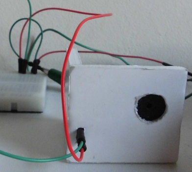
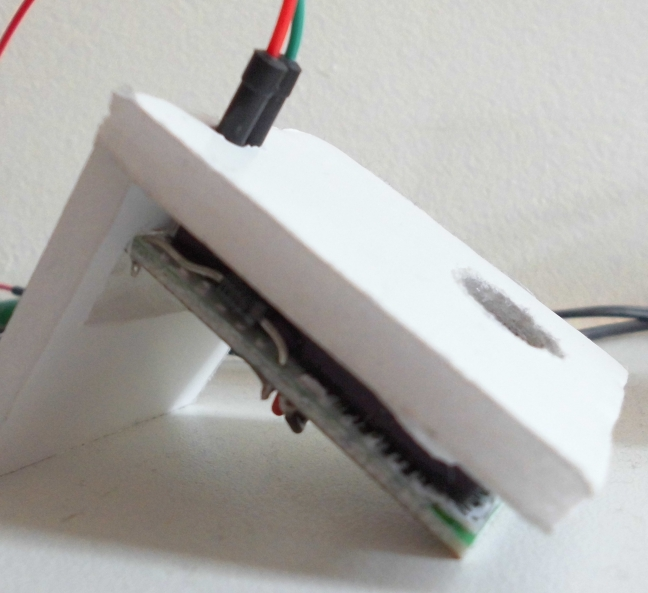
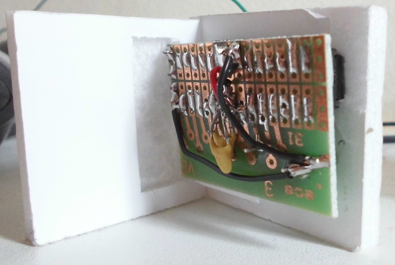

# Minimal PiClock

[PiClock](README.md) is an Arduino project for a clock that beeps at pi o'clock PM.

This [PiClock](README.md) only has a single beeper.

## How to read the time

You cannot. It only beeps at pi o'clock.

## Minimal PiClock 

