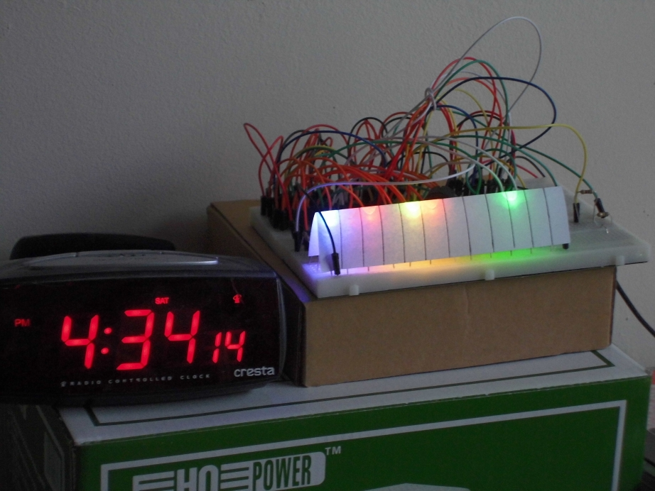

# PiClock

The PiClock is [one of my machines](https://github.com/richelbilderbeek/Machines) that uses Arduino.
It is a clock that displays the time in binary and beeps at pi o'clock PM.

There are multiple PiClocks:

 * [PiClock using NeoPixels](NeoPixels.md)
 * [PiClock using RGB LEDs](RgbLeds.md)

You can also read the [FAQ](FAQ.md).

## Neopixels and RGB LEDs PiClock

Thanks to James Rosindell for the picture

## Neopixels PiClock

## RGB LEDs PiClock 

Still a prototype.
