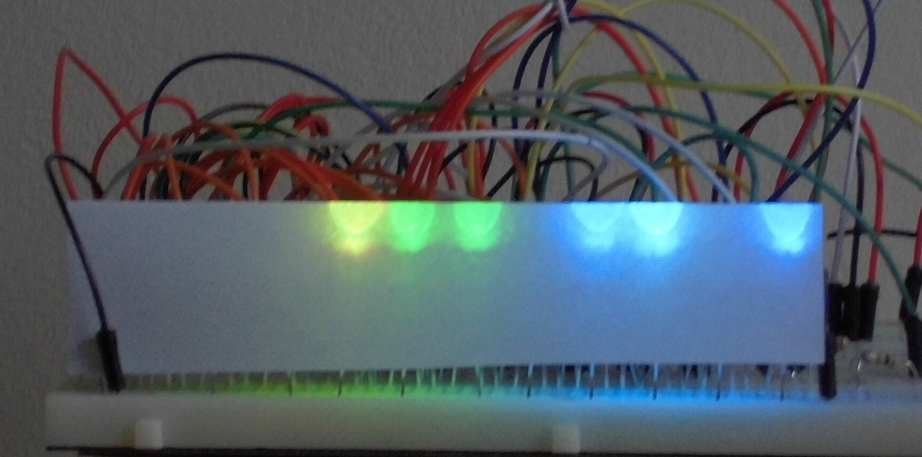

# PiClock using RGB LEDs

[PiClock](README.md) is an Arduino project for a clock that displays the time in binary and beeps at pi o'clock PM.

This [PiClock](README.md) uses RGB LEDs to display the time.

## How to read the time

See [How to read the time](HowToReadTheTime.md).

## Prototype

